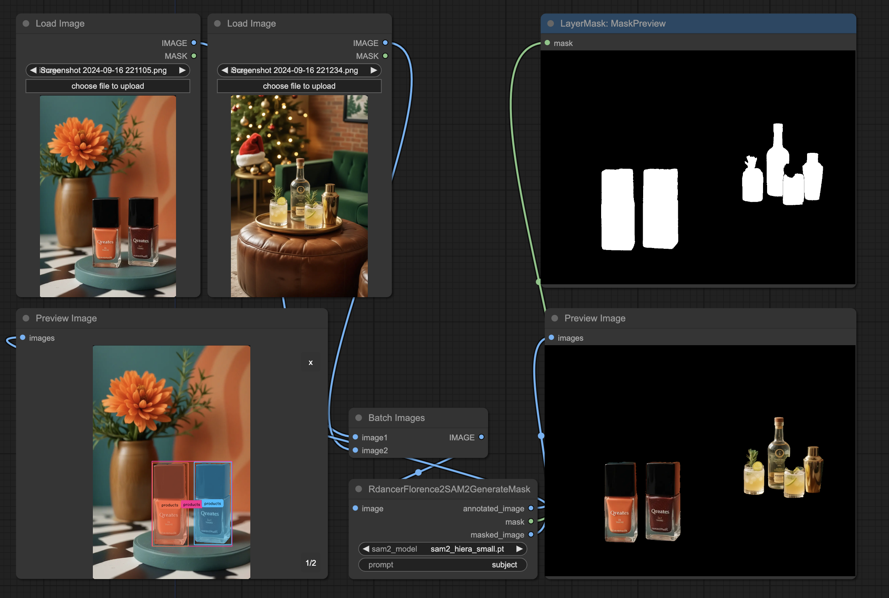

ComfyUI custom node implementing Florence 2 + Segment Anything Model 2, based on [SkalskiP's HuggingFace space](https://huggingface.co/spaces/SkalskiP/florence-sam)

*RdancerFlorence2SAM2GenerateMask* - the node is self-contained, and does not require separate model loaders. Models are lazy-loaded, and cached. Model unloading, if required, must be done manually.

## Testing

Run `python test.py test/*_source.png "products"` 👉 the resulting images must pixel-match `test/*output*`.
