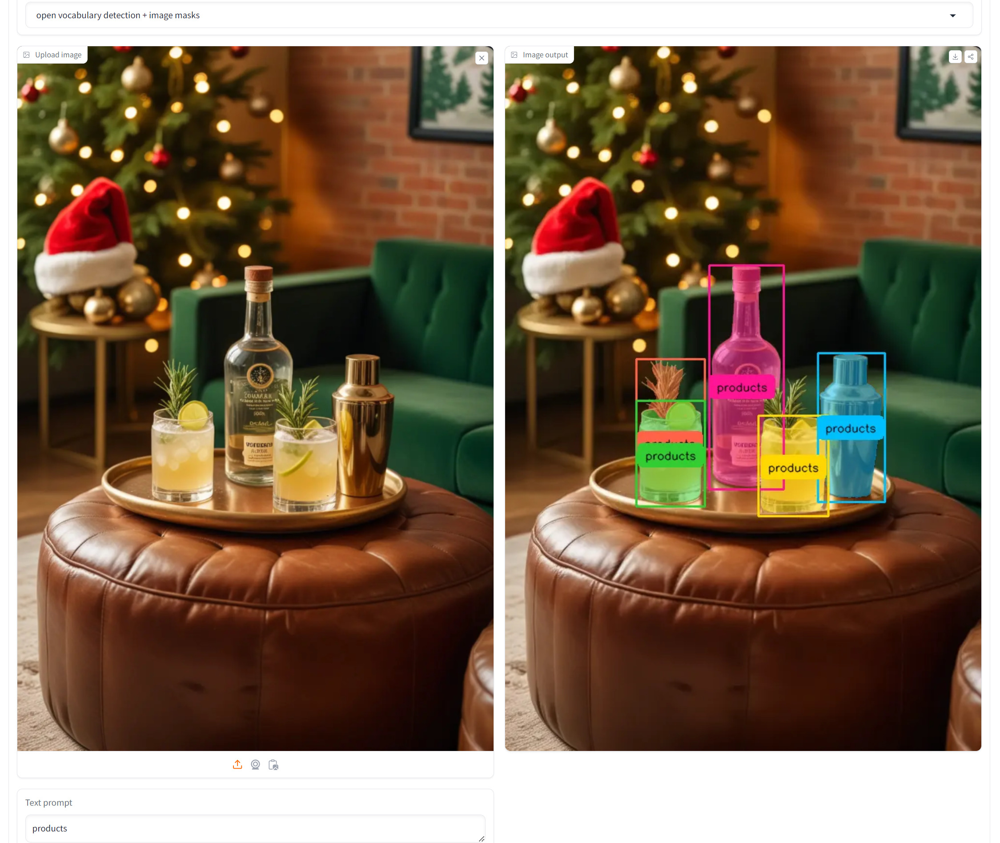
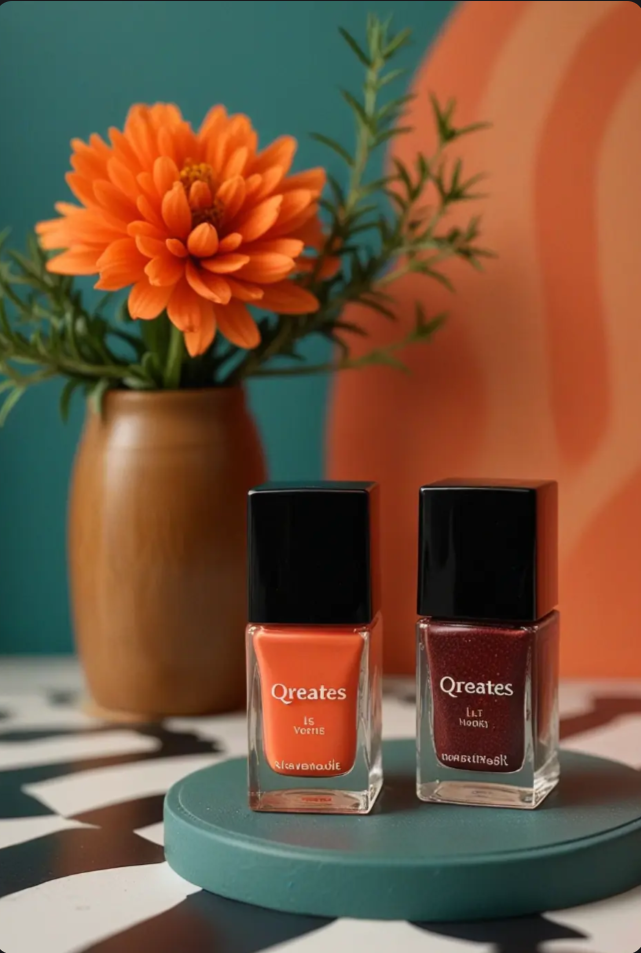
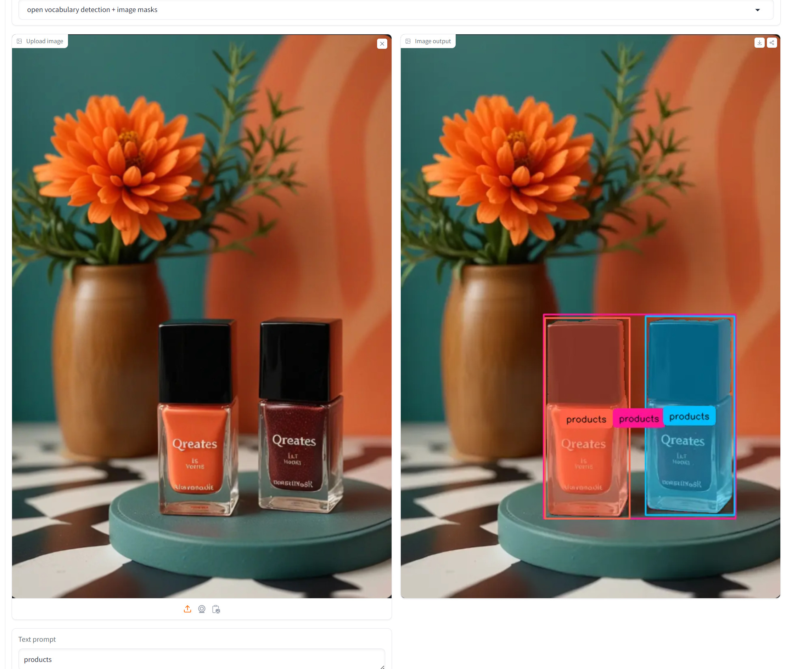

- 1 image goes in and has a prompt "products" and then out comes a mask with all the segmented products in the image
- But it could output a batch or list (I will probably just end up combining them all in the next node)

Note: Instead of bounding boxes with labels we **just need the masks** that's it

<table>
<tr><th>source image</th><th>screenshot (left: source; right: result)</th></tr>
<tr><td>

</td><td>

</td></tr>

<tr><td>

</td><td>

</td></tr>

</table>

The test images have been confirmed to work with this version of the code, and the screenshots above were taken from the [HuggingFace space](https://huggingface.co/spaces/SkalskiP/florence-sam).